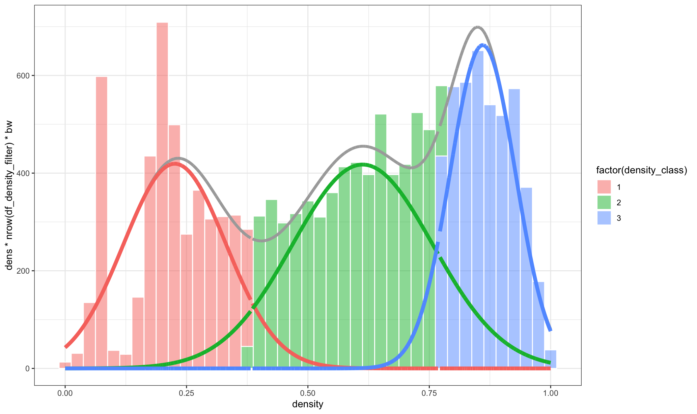
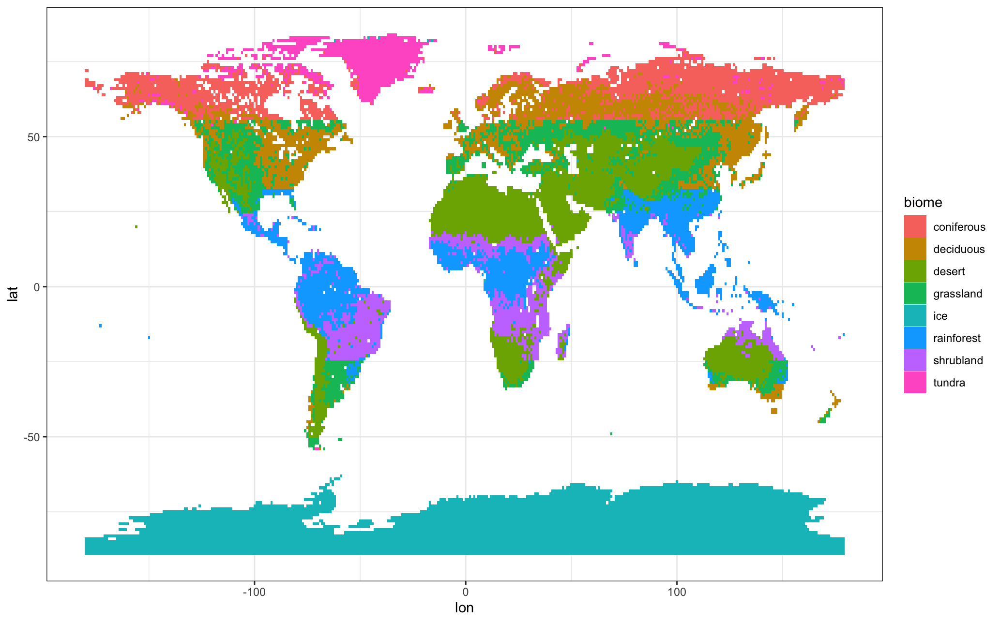
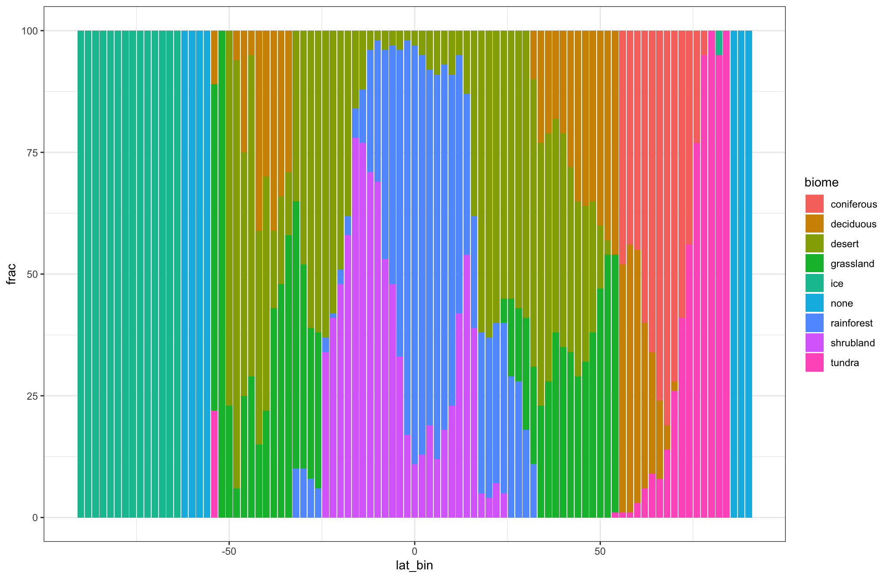

# biomes-world

## Step 1: Data preparation

### Get data
Biome description: [NASA earth observatory](https://earthobservatory.nasa.gov/biome)
Vegetation index data: [NASA NDVI](https://neo.gsfc.nasa.gov/view.php?datasetId=MOD_NDVI_M)
Average land temperature: [NASA LSTD](https://neo.gsfc.nasa.gov/view.php?datasetId=MOD_LSTD_CLIM_M)

### Density classification
[R script](biom_data_preparation.R) to calculate Gaussian Mixture Models on density and classify into three groups.




### Biome classification
Transform density classification into biomes based on the following logic.

```
class == 1 & (lat > 52 | lat < -52) ~ 'tundra',
class == 1 & (lat <= 52 & lat >= -52) ~ "desert",
class == 2 & (lat > 55 | lat < -55) ~ "coniferous",
class == 2 & (lat < 25 & lat > -25) ~ "shrubland",
class == 2 & (lat >= 25 | lat <= -25) ~ "grassland",
class == 3 & (lat > 32 | lat < -32) ~ "deciduous",
class == 3 & (lat <= 32 & lat >= -32) ~ "rainforest",
TRUE ~ 'other'
```



### Biomes per latitude bin
Calculate biome distribution per latitude bin.




## Step 2: Blender biome video
Import biomes.csv from Step 1 into Blender via the Spreadsheet Data Importer. 

```
Import-Export: Spreadsheet Data Importer
File > Import > Spreadsheet Import (.csv, .json)
Add Field Names and data types
```

Create biome animation with geometry nodes

### Step 3: Sonic PI soundtrack
Create background music with [Sonic PI script](biom_soundtrack.rb).

### Step 4: Finalize in Davinci Resolve
Create final video with Davinci Resolve.

